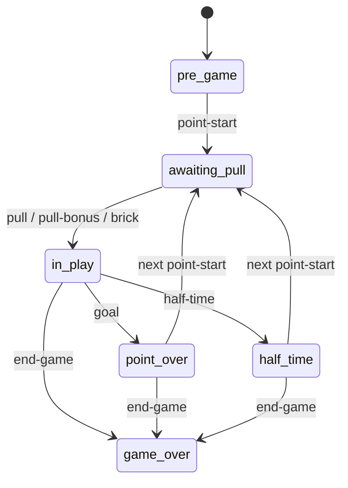
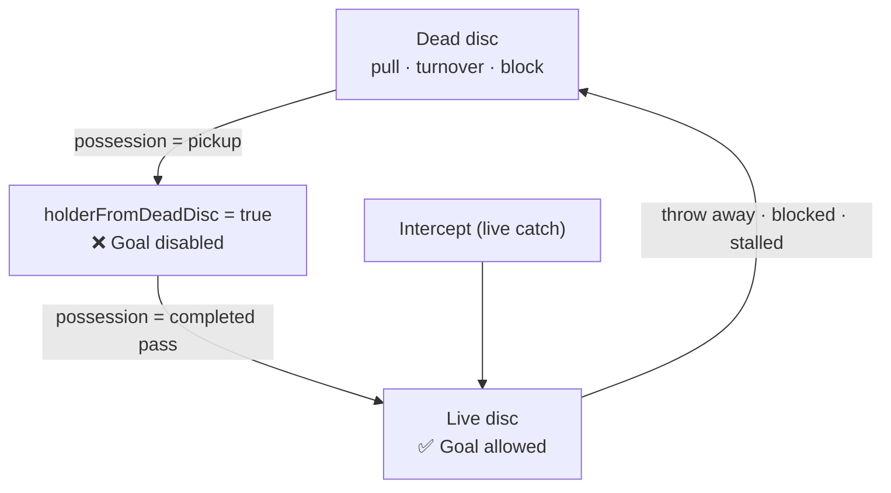

# Component Map

A reference for the technical names of every screen and the components inside it,
so changes can be described precisely ("the **EventColumn**", "the **ModeBanner**",
"**PlayerColumn** dull tile"). Each screen has a wireframe + a glossary (component →
file → what it is). Live screenshots accompany this in PR #8.

> Conventions: **mono-caps labels** = the `Label` system voice; **scores/big numerals**
> = the `--font-display` (Rajdhani) scoreboard face; team-coloured fills = team identity.

---

## Shared building blocks

| Component | File | What it is |
|---|---|---|
| `Btn` | `components/ui/Btn.tsx` | Button. Variants: `default` · `primary` · `ghost` · `success` · `warn` · `danger` · `block`. |
| `Chip` | `components/ui/Chip.tsx` | Pill badge. `soft` (alpha fill) or `solid` (team-colour + luminance-aware ink). |
| `Label` | `components/ui/Label.tsx` | Mono-caps, wide-tracked system label. |
| `Icons` | `components/ui/Icons.tsx` | SVG icon set: `BackIcon` `CloseIcon` `UndoIcon` `WarnIcon` `CheckIcon` `CursorIcon` `SettingsIcon` `InfoIcon` `TeamsIcon` `SwapEndsIcon`, plus `IconBtn` (44px tap target). |
| form kit | `components/ui/form.tsx` | `TextField` · `ColorField` · `Stepper` · `Section` · `GenderSelect` — the shared form controls (one implementation; used by NewGame, GameSettings, TeamsManager, LineSelection). |
| `ScreenHeader` | `components/ScreenHeader.tsx` | The shared h-16 top strip: kicker/title block **or** centred content, optional back arrow, right action. Used by every simple screen; the two score headers stay bespoke. |
| `ModalScrim` | `components/ModalScrim.tsx` | Scrim + panel scaffold behind every modal (backdrop-dismiss + propagation stop built in). `dialog` = centred card; `bare` = caller-styled panel (e.g. bottom sheets). |
| `MomentBackdrop` | `components/MomentBackdrop.tsx` | Atmospheric layer (tinted glow + endzone lines + vignette + grain) behind the "moment" screens. |
| `PromptSheet` | `components/PromptSheet.tsx` | In-app text-input dialog (replaces `window.prompt`). Built on `ModalScrim`. |
| `ConfirmSheet` | `components/ConfirmSheet.tsx` | In-app yes/no dialog (replaces `window.confirm`). Built on `ModalScrim`. |

---

## Game Setup (Games list) — `screens/GameSetup/index.tsx`

```
┌────────────────────────────────────────────┐
│ GAME SETUP                  [Teams] [Settings]   ← Header (IconBtn × 2)
│ Games                                       │
├────────────────────────────────────────────┤
│ Empire vs Breeze                  ( SCHED ) │  ← game row (status Chip)
│ 09:00 · [NYE] vs [DCB]              5 – 3    │  ← team Chips (solid) · high-water score
│  ┌ (expanded) ─────────────────────────┐    │
│  │ Who will pull first?                 │    │  ← pull-first picker
│  │ [ New York Empire ] [ DC Breeze ]    │    │
│  │ [      Start Recording      ]        │    │
│  └──────────────────────────────────────┘    │
│                                       (+)   │  ← FAB → New Game
└────────────────────────────────────────────┘
```

| Region | Component / name | Notes |
|---|---|---|
| Top bar | `ScreenHeader` | kicker + title, `IconBtn`(`TeamsIcon`) + `IconBtn`(`SettingsIcon`) on the right. |
| Each game | game row (local `button`) | `Chip` status (LIVE/DONE/SCHED), team `Chip`s, high-water score (mono). |
| Inline expand | pull-first picker (local) | team buttons + `Start Recording` `Btn`; LIVE games skip straight into Live Entry. |
| Bottom-right | FAB (local `button`) | opens `NewGameForm`. |

## New Game — `screens/NewGame/index.tsx`

| Region | Component | Notes |
|---|---|---|
| Header | `ScreenHeader` | back · centred `Label` "NEW GAME" · Save `Btn`. |
| Body | `Section` / `TextField` / `Stepper` (shared, `ui/form`) + `TeamPicker` (local) | |
| New-team flow | **`PromptSheet`** | "+ Add new team…" opens it (no native prompt). |

## Line Selection — `screens/LineSelection/index.tsx`

```
┌────────────────────────────────────────────┐
│ ←   [NYE] 5 – 3 [DCB]            [Confirm]  │  ← header (score = font-display)
├────────────────────────────────────────────┤
│ [ New York Empire • ] [ DC Breeze • ]      │  ← TeamTab switcher (ratio dot)
│           [info][teams][settings]          │  ← IconBtn row
│  (FMP 3/3)            (MMP 4/4)             │  ← GenderColumn headings (Chip)
│  [✓ Jordan]          [✓ Alex   #7]         │  ← PlayerTile (CheckIcon)
│  [  Leah  ]          [✓ Ben    #23]        │
│  [+ Add]             [+ Add]               │  ← AddPlayerRow
└────────────────────────────────────────────┘
```

| Region | Component | Notes |
|---|---|---|
| Header score | inline, `font-display` | |
| Tabs | `TeamTab` | per-team, with green/amber ratio dot. |
| Roster | `TeamPanel` → `GenderColumn` → `PlayerTile` (`CheckIcon`) | mixed = two gender columns; open = one column. |
| Add | `AddPlayerRow` | inline new-player form. |
| Over-quota confirm | `OverrideDialog` | |

## Live Entry — `screens/LiveEntry/index.tsx` (+ subfiles)

```
┌────────────────────────────────────────────┐
│ ←   [NYE] 5 ⇄ 3 [DCB]              (i)      │  ← Header.tsx (score pulses on goal)
├────────────────────────────────────────────┤
│  VIEWING HISTORY · RECORD TO TRUNCATE…      │  ← ModeBanner (pick / preview), 2-line
│           TAP TO CANCEL                      │
├────────────────────────────────────────────┤
│ — Point Started —              LOG ▾  ↶UNDO │  ← LogPeek.tsx
├───────────────┬────────┬───────────────────┤
│  EventColumn  │ spacer │   PlayerColumn     │
│  [Receiver Er]│  ▓▓▓▓  │   [ Aidan  ]       │  ← SankeyBridge ribbon wraps the
│  [Throw away ]│ Sankey │   [ Charlie]       │     active tile ↔ action buttons
│  [Blocked…   ]│ Bridge │   [ … ]            │
│  [Goal       ]│        │   [+ ][Unknown]    │  ← dull tiles (discouraged)
│  [   More    ]│        │                    │
└───────────────┴────────┴───────────────────┘
        (BottomSheet slides up over all of this)
```

| Region | Component | File | Notes |
|---|---|---|---|
| Top strip | `Header` | `Header.tsx` | `BackIcon`, team `Chip`s, score (`font-display`, **pulses on goal**), `SwapEndsIcon`, `ScorerInfoButton`. |
| Mode strips | **`ModeBanner`** | `index.tsx` | pick-mode / rewind-preview; label + `TAP TO CANCEL` on its own line. |
| Status strip | `LogPeek` | `LogPeek.tsx` | last event (point-start shows the short `— Point Started —`); `LOG ▾`; `UndoIcon` UNDO. |
| Players | `PlayerColumn` | `PlayerColumn.tsx` | player tiles (active = transparent over the wash); **dull tiles** (`+` add-slot, Unknown Player) = *discouraged*; remove badge (`CloseIcon`). |
| Actions | `EventColumn` → `EventBtn` | `EventColumn.tsx` | Goal / Throw away / Receiver Error / Blocked / Intercepted / Stall / Unknown turnover (*discouraged*) / Pull·Bonus·Brick / More. **Disabled vs discouraged** are now visually distinct. |
| Ribbon | `SankeyBridge` | `SankeyBridge.tsx` (+ `useTween.ts`) | animated team-colour ribbon from the active player to the action stack. |
| Pass arrows | `PassNotation` | `PassNotation.tsx` | overlay arrows over the player column. |
| Sheet | `BottomSheet` | `BottomSheet.tsx` | LOG tab (entries, `CursorIcon` rewind marker) · MORE tab (stoppages, manual triggers, Resume-from-score `ScoreSpinner`); `CloseIcon`. |
| Backfill | `BackfillPicker` | `index.tsx` | mid-point "add player to line". |
| End | `GameOverBanner` | `index.tsx` | `MomentBackdrop` + final score (`font-display`) + winner. |

## Point Summary — `screens/PointSummary/index.tsx`

```
┌────────────────────────────────────────────┐
│            (MomentBackdrop behind)          │
│              POINT COMPLETE                  │  ┐
│               ( NYE )                        │  │ staggered fade-up
│               6 – 3                          │  │ (font-display, 8xl)
│           Goal — Jordan                      │  │
│         Clean hold — no turnovers            │  ┘
│           TAP ANYWHERE TO CONTINUE           │
├────────────────────────────────────────────┤
│ [↶ Undo goal] [ View log ] [ Next point ]  │  ← action bar
└────────────────────────────────────────────┘
```

| Region | Component | Notes |
|---|---|---|
| Backdrop | **`MomentBackdrop`** | tinted to the scoring team. |
| Stack | local lines | staggered `fadeUp`; score = `font-display`; `WarnIcon` data-quality alert. |
| Action bar | `Btn` × 3 | Undo goal (`default`) · View log (`default`) · Next point (`primary`). |

## Teams Manager — `screens/TeamsManager/index.tsx`

| View | Components | Notes |
|---|---|---|
| List | `ScreenHeader` · team rows (`Chip`) · `+ New Team` · Reset (`WarnIcon`) → **`ConfirmSheet`** | |
| New team | `NewTeamView` (`ScreenHeader`, shared `TextField` / `ColorField`) | |
| Detail | `TeamDetailView` (`ScreenHeader`) → `PlayerRow` (`GenderSelect`, `CloseIcon` remove) · `AddPlayerInline`; Archive → **`ConfirmSheet`** | |

## Game Settings — `screens/GameSettings/index.tsx`

`ScreenHeader` (kicker "RECORDING SETTINGS", Done `Btn`) + shared `Section` /
`Stepper` rows and local `CompactToggle`s for the optional recording events
(Stall, Foul, Pick, Pull Bonus, Brick, passes, …).

---

## Game flow & goal eligibility

Phases are derived from the log by `deriveGameState` (`core/engine.ts`); `canRecord`
is the single guard for every action.



**Goal eligibility — no goal off a dead disc.** Whenever the disc goes dead (a pull,
*any* turnover, or a block) the next `possession` is a *pickup*: the engine flags the
holder `holderFromDeadDisc`, and `canRecord('goal')` is **false** until they complete a
pass. An **intercept** is a *live* catch (it sets the holder directly and never raises
the flag), so a Callahan straight off an intercept is allowed.



Reference: `holderFromDeadDisc` / `deadDiscPending` in `core/types.ts` (`DerivedGameState`),
set in `core/engine.ts` (`step`), enforced in `canRecord('goal')`.
